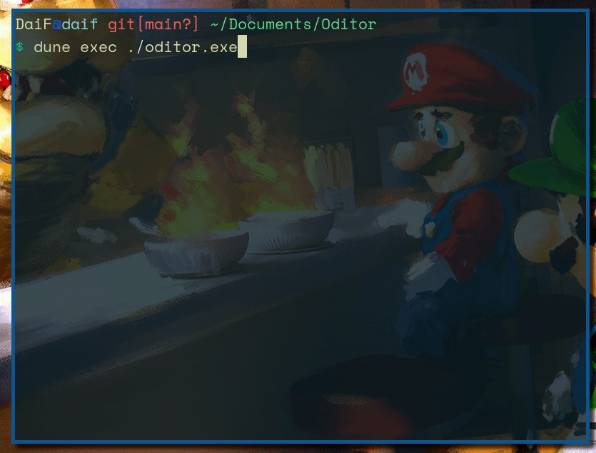

# Oditor
A simple text editor written in OCaml

## How to run the program ?

Easy,
- clone the repo
- `cd Oditor`
- `dune exec ./oditor.exe`

## Text editing

Oditor is a text editor for OCaml. It provides syntax highlighting for `.ml`
files and uses Vim key bindings.

#### Using the editor

 You can move around using the arrow keys or `ctrl+arrow` to move faster across
 words.

 To quit the editor, press `ctrl+q`.

 To run a command, press `ctrl+r` and type your command. To see the availables
 commands, check out the **Commands** section.

#### File Manipulation

To create a new file, you simply need to press `ctrl+n`.
You can save this file using `ctrl+s`.
You can also open a new file using `ctrl+o`

## Commands

Here are the currently supported commands:

- "setkmap", change the current keymap.

## Vim Controls

The editor comes with builtin vim controls. Those can be loaded by using the
command `setkmap vim`

#### Normal mode 

You can move around using `h`, `j`, `k`, `l` or using the `e`, `w` and `b` 
motions.

The text will automatically scroll up or down by moving the cursor out of the
screen.

You can enter Insert mode by pressing:

- `i` to insert on current character

- `a` to insert on next character

- `I` to insert at the start of the line

- `A` to insert at the end of the line

#### Insert mode

Insert mode allows the user to add text. It can be exited by pressing the esc key.

#### Command mode

Here are the supported commands with the vim keymaps:

- `edit xxx` which takes as parameter the file you want to edit. 
    Only works for existing files.

- `w` or `w xxx` which saves the current file. It can be given a new file name 
    as parameter

- `q` which quits Oditor.

- `wq` which saves the file and quits Oditor.

You can use `Ctrl+W` to empty the command buffer.

## Coming soon

- Autocompletion
- Tuareg mode
- Dune compilation tools 
